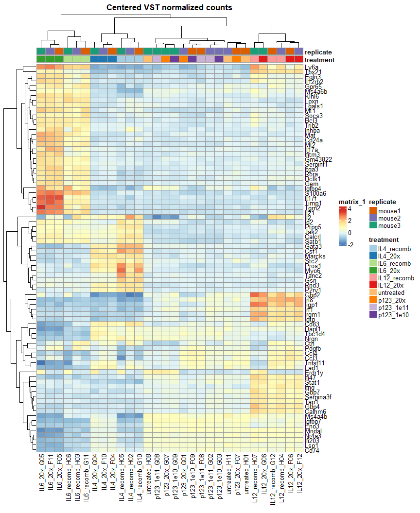
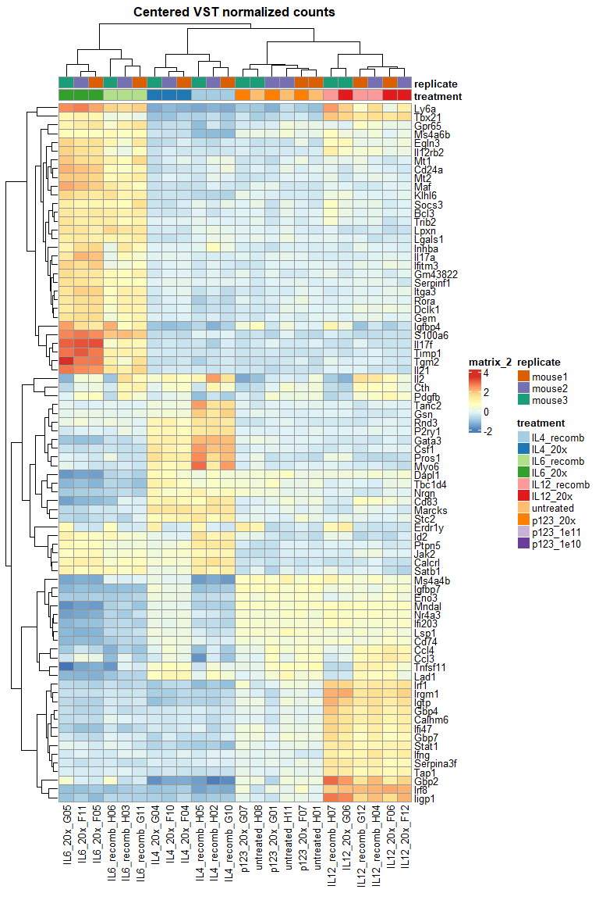

p123 RNAseq DEseq Analysis
================
Eric Y. Wang
2024-09-03

- [<u>Import Data</u>](#import-data)
- [<u>DE Analysis</u>](#de-analysis)

``` r
library(tidyverse)
```

    ## ── Attaching core tidyverse packages ──────────────────────── tidyverse 2.0.0 ──
    ## ✔ dplyr     1.1.4     ✔ readr     2.1.5
    ## ✔ forcats   1.0.0     ✔ stringr   1.5.1
    ## ✔ ggplot2   3.5.1     ✔ tibble    3.2.1
    ## ✔ lubridate 1.9.3     ✔ tidyr     1.3.1
    ## ✔ purrr     1.0.2     
    ## ── Conflicts ────────────────────────────────────────── tidyverse_conflicts() ──
    ## ✖ dplyr::filter() masks stats::filter()
    ## ✖ dplyr::lag()    masks stats::lag()
    ## ℹ Use the conflicted package (<http://conflicted.r-lib.org/>) to force all conflicts to become errors

``` r
library(ggplot2)
library(cowplot)
```

    ## 
    ## Attaching package: 'cowplot'
    ## 
    ## The following object is masked from 'package:lubridate':
    ## 
    ##     stamp

``` r
library(patchwork)
```

    ## 
    ## Attaching package: 'patchwork'
    ## 
    ## The following object is masked from 'package:cowplot':
    ## 
    ##     align_plots

``` r
library(DESeq2)
```

    ## Loading required package: S4Vectors
    ## Loading required package: stats4
    ## Loading required package: BiocGenerics
    ## 
    ## Attaching package: 'BiocGenerics'
    ## 
    ## The following objects are masked from 'package:lubridate':
    ## 
    ##     intersect, setdiff, union
    ## 
    ## The following objects are masked from 'package:dplyr':
    ## 
    ##     combine, intersect, setdiff, union
    ## 
    ## The following objects are masked from 'package:stats':
    ## 
    ##     IQR, mad, sd, var, xtabs
    ## 
    ## The following objects are masked from 'package:base':
    ## 
    ##     anyDuplicated, aperm, append, as.data.frame, basename, cbind,
    ##     colnames, dirname, do.call, duplicated, eval, evalq, Filter, Find,
    ##     get, grep, grepl, intersect, is.unsorted, lapply, Map, mapply,
    ##     match, mget, order, paste, pmax, pmax.int, pmin, pmin.int,
    ##     Position, rank, rbind, Reduce, rownames, sapply, setdiff, table,
    ##     tapply, union, unique, unsplit, which.max, which.min
    ## 
    ## 
    ## Attaching package: 'S4Vectors'
    ## 
    ## The following objects are masked from 'package:lubridate':
    ## 
    ##     second, second<-
    ## 
    ## The following objects are masked from 'package:dplyr':
    ## 
    ##     first, rename
    ## 
    ## The following object is masked from 'package:tidyr':
    ## 
    ##     expand
    ## 
    ## The following object is masked from 'package:utils':
    ## 
    ##     findMatches
    ## 
    ## The following objects are masked from 'package:base':
    ## 
    ##     expand.grid, I, unname
    ## 
    ## Loading required package: IRanges
    ## 
    ## Attaching package: 'IRanges'
    ## 
    ## The following object is masked from 'package:lubridate':
    ## 
    ##     %within%
    ## 
    ## The following objects are masked from 'package:dplyr':
    ## 
    ##     collapse, desc, slice
    ## 
    ## The following object is masked from 'package:purrr':
    ## 
    ##     reduce
    ## 
    ## The following object is masked from 'package:grDevices':
    ## 
    ##     windows
    ## 
    ## Loading required package: GenomicRanges
    ## Loading required package: GenomeInfoDb
    ## Loading required package: SummarizedExperiment
    ## Loading required package: MatrixGenerics
    ## Loading required package: matrixStats
    ## 
    ## Attaching package: 'matrixStats'
    ## 
    ## The following object is masked from 'package:dplyr':
    ## 
    ##     count
    ## 
    ## 
    ## Attaching package: 'MatrixGenerics'
    ## 
    ## The following objects are masked from 'package:matrixStats':
    ## 
    ##     colAlls, colAnyNAs, colAnys, colAvgsPerRowSet, colCollapse,
    ##     colCounts, colCummaxs, colCummins, colCumprods, colCumsums,
    ##     colDiffs, colIQRDiffs, colIQRs, colLogSumExps, colMadDiffs,
    ##     colMads, colMaxs, colMeans2, colMedians, colMins, colOrderStats,
    ##     colProds, colQuantiles, colRanges, colRanks, colSdDiffs, colSds,
    ##     colSums2, colTabulates, colVarDiffs, colVars, colWeightedMads,
    ##     colWeightedMeans, colWeightedMedians, colWeightedSds,
    ##     colWeightedVars, rowAlls, rowAnyNAs, rowAnys, rowAvgsPerColSet,
    ##     rowCollapse, rowCounts, rowCummaxs, rowCummins, rowCumprods,
    ##     rowCumsums, rowDiffs, rowIQRDiffs, rowIQRs, rowLogSumExps,
    ##     rowMadDiffs, rowMads, rowMaxs, rowMeans2, rowMedians, rowMins,
    ##     rowOrderStats, rowProds, rowQuantiles, rowRanges, rowRanks,
    ##     rowSdDiffs, rowSds, rowSums2, rowTabulates, rowVarDiffs, rowVars,
    ##     rowWeightedMads, rowWeightedMeans, rowWeightedMedians,
    ##     rowWeightedSds, rowWeightedVars
    ## 
    ## Loading required package: Biobase
    ## Welcome to Bioconductor
    ## 
    ##     Vignettes contain introductory material; view with
    ##     'browseVignettes()'. To cite Bioconductor, see
    ##     'citation("Biobase")', and for packages 'citation("pkgname")'.
    ## 
    ## 
    ## Attaching package: 'Biobase'
    ## 
    ## The following object is masked from 'package:MatrixGenerics':
    ## 
    ##     rowMedians
    ## 
    ## The following objects are masked from 'package:matrixStats':
    ## 
    ##     anyMissing, rowMedians

``` r
library(ComplexHeatmap)
```

    ## Loading required package: grid
    ## ========================================
    ## ComplexHeatmap version 2.20.0
    ## Bioconductor page: http://bioconductor.org/packages/ComplexHeatmap/
    ## Github page: https://github.com/jokergoo/ComplexHeatmap
    ## Documentation: http://jokergoo.github.io/ComplexHeatmap-reference
    ## 
    ## If you use it in published research, please cite either one:
    ## - Gu, Z. Complex Heatmap Visualization. iMeta 2022.
    ## - Gu, Z. Complex heatmaps reveal patterns and correlations in multidimensional 
    ##     genomic data. Bioinformatics 2016.
    ## 
    ## 
    ## The new InteractiveComplexHeatmap package can directly export static 
    ## complex heatmaps into an interactive Shiny app with zero effort. Have a try!
    ## 
    ## This message can be suppressed by:
    ##   suppressPackageStartupMessages(library(ComplexHeatmap))
    ## ========================================

``` r
knitr::opts_chunk$set(echo = TRUE)
```

``` r
source("functions/plotting_fxns.R")
theme_set(theme_Publication())
```

    ## 
    ## Attaching package: 'ggthemes'

    ## The following object is masked from 'package:cowplot':
    ## 
    ##     theme_map

### <u>Import Data</u>

``` r
data <- read.csv("C:/Users/Eric/My Drive/Lab/datasets/EYW/RNAseq_p123_240806/processed_data/RNAseq_p123_counts.csv", row.names = "X")

metadata <- read_csv("C:/Users/Eric/My Drive/Lab/datasets/EYW/RNAseq_p123_240806/processed_data/processed_metadata.csv")
```

    ## Rows: 33 Columns: 7
    ## ── Column specification ────────────────────────────────────────────────────────
    ## Delimiter: ","
    ## chr (5): sample_ID, barcode, well, treatment, replicate
    ## dbl (2): nFeature_RNA, nCount_RNA
    ## 
    ## ℹ Use `spec()` to retrieve the full column specification for this data.
    ## ℹ Specify the column types or set `show_col_types = FALSE` to quiet this message.

``` r
# import feature names
featureNames <- read_tsv("C:/Users/Eric/My Drive/Lab/datasets/EYW/RNAseq_p123_240806/star_outputSolo.out/Gene/raw/features.tsv", col_names = F)
```

    ## Rows: 57186 Columns: 3
    ## ── Column specification ────────────────────────────────────────────────────────
    ## Delimiter: "\t"
    ## chr (3): X1, X2, X3
    ## 
    ## ℹ Use `spec()` to retrieve the full column specification for this data.
    ## ℹ Specify the column types or set `show_col_types = FALSE` to quiet this message.

``` r
colnames(featureNames) <- c("ensembl_ID","gene","category")
featureNames <- select(featureNames, -category)
```

``` r
# remove some untreated samples to balance out groups
metadata <- metadata %>%
  filter(!(well %in% c("H09","H10","H12")))
data <- data[,metadata$sample_ID]
```

### <u>DE Analysis</u>

``` r
metadata <- metadata %>%
  mutate(treatment = factor(treatment, c("IL4_recomb","IL4_20x",
                                            "IL6_recomb","IL6_20x",
                                            "IL12_recomb","IL12_20x",
                                            "untreated","p123_20x",
                                            "p123_1e11","p123_1e10")))

# prepare metadata for DESeq
metaDF <- as.data.frame(metadata[,-1])
rownames(metaDF) <- metadata$sample_ID
```

``` r
# create DEseq object
dds <- DESeqDataSetFromMatrix(data,
                              colData = metaDF,
                              design = ~ treatment + replicate)
```

    ## Warning in DESeqDataSet(se, design = design, ignoreRank): some variables in
    ## design formula are characters, converting to factors

``` r
# prefilter dds
# remove any gene with fewer than 10 counts in the smallest group size
smallestGroupSize <- 3
keep <- rowSums(counts(dds) >= 10) >= smallestGroupSize
dds <- dds[keep,]
```

#### Assess sample similarity

First, we’ll perform PCA analysis to look at the overall similarity
between samples.

``` r
# perform VST normalization
# essentially normalizes to library size while stabilizing variance for lowly expressed genes
ddsNorm <- vst(dds)
```

``` r
p1 <- DESeq2::plotPCA(ddsNorm, intgroup = "treatment", ntop=500) + theme(aspect.ratio = 1) +
  scale_color_brewer(palette = "Paired") +
  ggtitle("PC1 PC2 by treatment")
```

    ## using ntop=500 top features by variance

``` r
p2 <- DESeq2::plotPCA(ddsNorm, intgroup = "treatment", ntop=500, pcsToUse = 3:4) + theme(aspect.ratio = 1) +
  scale_color_brewer(palette = "Paired") +
  ggtitle("PC3 PC4 by treatment")
```

    ## using ntop=500 top features by variance

``` r
p3 <- DESeq2::plotPCA(ddsNorm, intgroup = "replicate", ntop=500) + theme(aspect.ratio = 1) +
  scale_color_brewer(palette = "Paired") +
  ggtitle("PC1 PC2 by mouse")
```

    ## using ntop=500 top features by variance

``` r
p4 <- DESeq2::plotPCA(ddsNorm, intgroup = "replicate", ntop=500, pcsToUse = 3:4) + theme(aspect.ratio = 1) +
  scale_color_brewer(palette = "Paired") +
  ggtitle("PC3 PC4 by mouse")
```

    ## using ntop=500 top features by variance

``` r
(p1+p2)/(p3+p4)
```

<!-- -->

``` r
p1 <- DESeq2::plotPCA(ddsNorm[,-grep("^p123_1e",colnames(ddsNorm))], intgroup = "treatment", ntop=500) + theme(aspect.ratio = 1) +
  scale_color_brewer(palette = "Paired") +
  ggtitle("PC1 PC2 by treatment")
```

    ## using ntop=500 top features by variance

``` r
p2 <- DESeq2::plotPCA(ddsNorm[,-grep("^p123_1e",colnames(ddsNorm))], intgroup = "treatment", ntop=500, pcsToUse = 3:4) + theme(aspect.ratio = 1) +
  scale_color_brewer(palette = "Paired") +
  ggtitle("PC3 PC4 by treatment")
```

    ## using ntop=500 top features by variance

``` r
p3 <- DESeq2::plotPCA(ddsNorm[,-grep("^p123_1e",colnames(ddsNorm))], intgroup = "replicate", ntop=500) + theme(aspect.ratio = 1) +
  scale_color_brewer(palette = "Paired") +
  ggtitle("PC1 PC2 by mouse")
```

    ## using ntop=500 top features by variance

``` r
p4 <- DESeq2::plotPCA(ddsNorm[,-grep("^p123_1e",colnames(ddsNorm))], intgroup = "replicate", ntop=500, pcsToUse = 3:4) + theme(aspect.ratio = 1) +
  scale_color_brewer(palette = "Paired") +
  ggtitle("PC3 PC4 by mouse")
```

    ## using ntop=500 top features by variance

``` r
(p1+p2)/(p3+p4)
```

<!-- -->

#### Variable Genes

``` r
library(RColorBrewer)

# find top variable genes
topVarGenes <- head(order(rowVars(assay(ddsNorm)), decreasing = TRUE), 80)

# extract VST count matrix
mat  <- assay(ddsNorm)[topVarGenes, ]
# z-score VST counts
mat  <- t(scale(t(mat), center = T, scale = F))
anno <- as.data.frame(colData(ddsNorm)[, c("treatment","replicate")])

# replace rownames with gene names
rownames <- tibble(ensembl_ID = rownames(mat)) %>%
  left_join(featureNames)
```

    ## Joining with `by = join_by(ensembl_ID)`

``` r
rownames(mat) <- rownames$gene

pheatmap(mat, annotation_col = anno,
          annotation_colors = list(treatment = setNames(brewer.pal(10, "Paired"),levels(anno$treatment)),
                                   replicate = setNames(brewer.pal(3,"Dark2"),unique(anno$replicate))),
         main = "Centered VST normalized counts")
```

<!-- -->

There is biological variability between different mice. For example, Il2
is consistently not upregulated in one mouse across all treatments.

``` r
# extract VST count matrix
mat  <- assay(ddsNorm)[topVarGenes, ]
# z-score VST counts
mat  <- t(scale(t(mat), center = T, scale = F))
anno <- as.data.frame(colData(ddsNorm)[, c("treatment","replicate")])
# remove p123 titration samples
mat <- mat[,grep("^p123_1e",colnames(mat),invert = T)]
anno <- anno[grep("^p123_1e",rownames(anno),invert = T),]

# replace rownames with gene names
rownames <- tibble(ensembl_ID = rownames(mat)) %>%
  left_join(featureNames)
```

    ## Joining with `by = join_by(ensembl_ID)`

``` r
rownames(mat) <- rownames$gene

pheatmap(mat, annotation_col = anno,
          annotation_colors = list(treatment = setNames(brewer.pal(10, "Paired"),levels(anno$treatment)),
                                   replicate = setNames(brewer.pal(3,"Dark2"),unique(anno$replicate))),
         main = "Centered VST normalized counts")
```

<!-- -->

#### Calculate and plot DEGs

``` r
# perform DE analysis
dds <- DESeq(dds)
```

    ## estimating size factors

    ## estimating dispersions

    ## gene-wise dispersion estimates

    ## mean-dispersion relationship

    ## final dispersion estimates

    ## fitting model and testing

``` r
# plot dispersion model to examine best fit
plotDispEsts(dds)
```

<!-- -->

``` r
# get DEG results
# don't use independent filtering because already filtered genes

resLFCIl4virus <- results(dds, contrast = c("treatment","IL4_20x","p123_20x"), independentFiltering=F)
resLFCIl4virus <- lfcShrink(dds, type = "ashr", res=resLFCIl4virus) %>%
  as_tibble(rownames = "ensembl_ID") %>%
  left_join(featureNames) %>%
  mutate(treatment = "virus") %>%
  arrange(padj)
```

    ## using 'ashr' for LFC shrinkage. If used in published research, please cite:
    ##     Stephens, M. (2016) False discovery rates: a new deal. Biostatistics, 18:2.
    ##     https://doi.org/10.1093/biostatistics/kxw041

    ## Joining with `by = join_by(ensembl_ID)`

``` r
resLFCIl4recomb <- results(dds, contrast = c("treatment","IL4_recomb","untreated"), independentFiltering=F)
resLFCIl4recomb <- lfcShrink(dds, type = "ashr", res=resLFCIl4recomb) %>%
  as_tibble(rownames = "ensembl_ID") %>%
  left_join(featureNames) %>%
  mutate(treatment = "recombinant") %>%
  arrange(padj)
```

    ## using 'ashr' for LFC shrinkage. If used in published research, please cite:
    ##     Stephens, M. (2016) False discovery rates: a new deal. Biostatistics, 18:2.
    ##     https://doi.org/10.1093/biostatistics/kxw041
    ## Joining with `by = join_by(ensembl_ID)`

``` r
resLFCIl6virus <- results(dds, contrast = c("treatment","IL6_20x","p123_20x"), independentFiltering=F)
resLFCIl6virus <- lfcShrink(dds, type = "ashr", res=resLFCIl6virus) %>%
  as_tibble(rownames = "ensembl_ID") %>%
  left_join(featureNames) %>%
  mutate(treatment = "virus") %>%
  arrange(padj)
```

    ## using 'ashr' for LFC shrinkage. If used in published research, please cite:
    ##     Stephens, M. (2016) False discovery rates: a new deal. Biostatistics, 18:2.
    ##     https://doi.org/10.1093/biostatistics/kxw041
    ## Joining with `by = join_by(ensembl_ID)`

``` r
resLFCIl6recomb <- results(dds, contrast = c("treatment","IL6_recomb","untreated"), independentFiltering=F)
resLFCIl6recomb <- lfcShrink(dds, type = "ashr", res=resLFCIl6recomb) %>%
  as_tibble(rownames = "ensembl_ID") %>%
  left_join(featureNames) %>%
  mutate(treatment = "recombinant") %>%
  arrange(padj)
```

    ## using 'ashr' for LFC shrinkage. If used in published research, please cite:
    ##     Stephens, M. (2016) False discovery rates: a new deal. Biostatistics, 18:2.
    ##     https://doi.org/10.1093/biostatistics/kxw041
    ## Joining with `by = join_by(ensembl_ID)`

``` r
resLFCIl12virus <- results(dds, contrast = c("treatment","IL12_20x","p123_20x"), independentFiltering=F)
resLFCIl12virus <- lfcShrink(dds, type = "ashr", res=resLFCIl12virus) %>%
  as_tibble(rownames = "ensembl_ID") %>%
  left_join(featureNames) %>%
  mutate(treatment = "virus") %>%
  arrange(padj)
```

    ## using 'ashr' for LFC shrinkage. If used in published research, please cite:
    ##     Stephens, M. (2016) False discovery rates: a new deal. Biostatistics, 18:2.
    ##     https://doi.org/10.1093/biostatistics/kxw041
    ## Joining with `by = join_by(ensembl_ID)`

``` r
resLFCIl12recomb <- results(dds, contrast = c("treatment","IL12_recomb","untreated"), independentFiltering=F)
resLFCIl12recomb <- lfcShrink(dds, type = "ashr", res = resLFCIl12recomb) %>%
  as_tibble(rownames = "ensembl_ID") %>%
  left_join(featureNames) %>%
  mutate(treatment = "recombinant") %>%
  arrange(padj)
```

    ## using 'ashr' for LFC shrinkage. If used in published research, please cite:
    ##     Stephens, M. (2016) False discovery rates: a new deal. Biostatistics, 18:2.
    ##     https://doi.org/10.1093/biostatistics/kxw041
    ## Joining with `by = join_by(ensembl_ID)`

``` r
resLFCvirus <- results(dds, contrast = c("treatment","p123_1e11","untreated"), independentFiltering=F)
resLFCvirus <- lfcShrink(dds, type = "ashr", res=resLFCvirus) %>%
  as_tibble(rownames = "ensembl_ID") %>%
  left_join(featureNames) %>%
  arrange(padj)
```

    ## using 'ashr' for LFC shrinkage. If used in published research, please cite:
    ##     Stephens, M. (2016) False discovery rates: a new deal. Biostatistics, 18:2.
    ##     https://doi.org/10.1093/biostatistics/kxw041
    ## Joining with `by = join_by(ensembl_ID)`

``` r
resLFCvirus2 <- results(dds, contrast = c("treatment","p123_1e11","p123_1e10"), independentFiltering=F)
resLFCvirus2 <- lfcShrink(dds, type = "ashr", res=resLFCvirus2) %>%
  as_tibble(rownames = "ensembl_ID") %>%
  left_join(featureNames) %>%
  arrange(padj)
```

    ## using 'ashr' for LFC shrinkage. If used in published research, please cite:
    ##     Stephens, M. (2016) False discovery rates: a new deal. Biostatistics, 18:2.
    ##     https://doi.org/10.1093/biostatistics/kxw041
    ## Joining with `by = join_by(ensembl_ID)`

``` r
# Merge the reference tibble with the comparison data
comparisonTibIl4 <- resLFCIl4virus %>%
  left_join(resLFCIl4recomb, by = "ensembl_ID", suffix = c("", "_ref")) %>%
  mutate(
    significance = case_when(
      padj_ref < 0.1 & padj < 0.1 ~ "both",
      padj_ref < 0.1 ~ "recombinant specific",
      padj < 0.1 ~ "virus specific",
      TRUE ~ "none"
    )) %>%
  mutate(significance = factor(significance, c("none","recombinant specific","virus specific","both"))
  ) %>%
  filter(significance != "none")

# Plotting
p1 <- ggplot(comparisonTibIl4, aes(x = log2FoldChange_ref, y = log2FoldChange, color = significance)) +
  geom_point() +
  geom_abline(slope = 1, intercept = 0, linetype = "dashed") +
  theme(aspect.ratio = 1) +
  scale_color_brewer(palette = "Dark2") +
  xlim(-5,7)+
  ylim(-5,7)+
  labs(
    title = "IL4",
    x = "log2FC (recombinant)",
    y = "log2FC (virus)"
  )

# Merge the reference tibble with the comparison data
comparisonTibIl6 <- resLFCIl6virus %>%
  left_join(resLFCIl6recomb, by = "ensembl_ID", suffix = c("", "_ref")) %>%
  mutate(
    significance = case_when(
      padj_ref < 0.1 & padj < 0.1 ~ "both",
      padj_ref < 0.1 ~ "recombinant specific",
      padj < 0.1 ~ "virus specific",
      TRUE ~ "none"
    )) %>%
  mutate(significance = factor(significance, c("none","recombinant specific","virus specific","both"))
  ) %>%
  filter(significance != "none")

# Plotting
p2 <- ggplot(comparisonTibIl6, aes(x = log2FoldChange_ref, y = log2FoldChange, color = significance)) +
  geom_point() +
  geom_abline(slope = 1, intercept = 0, linetype = "dashed") +
  theme(aspect.ratio = 1) +
  scale_color_brewer(palette = "Dark2") +
  xlim(-7,8)+
  ylim(-7,8)+
  labs(
    title = "IL6",
    x = "log2FC (recombinant)",
    y = "log2FC (virus)"
  )
  

# Merge the reference tibble with the comparison data
comparisonTibIl12 <- resLFCIl12virus %>%
  left_join(resLFCIl12recomb, by = "ensembl_ID", suffix = c("", "_ref")) %>%
  mutate(
    significance = case_when(
      padj_ref < 0.1 & padj < 0.1 ~ "both",
      padj_ref < 0.1 ~ "recombinant specific",
      padj < 0.1 ~ "virus specific",
      TRUE ~ "none"
    )) %>%
  mutate(significance = factor(significance, c("none","recombinant specific","virus specific","both"))
  ) %>%
  filter(significance != "none")

# Plotting
p3 <- ggplot(comparisonTibIl12, aes(x = log2FoldChange_ref, y = log2FoldChange, color = significance)) +
  geom_point() +
  geom_abline(slope = 1, intercept = 0, linetype = "dashed") +
  theme(aspect.ratio = 1) +
  scale_color_brewer(palette = "Dark2") +
  xlim(-2.5,5)+
  ylim(-2.5,5)+
  labs(
    title = "IL12",
    x = "log2FC (recombinant)",
    y = "log2FC (virus)"
  )

plot_grid(p1,p2,p3,ncol = 2)
```

<!-- -->

``` r
library(ggrepel)

resLFCvirus %>%
  filter(padj < 0.1) %>%
  ggplot(aes(x = log2FoldChange, y = -log10(padj))) +
    geom_point() +
    geom_text_repel(aes(label = gene),show.legend = FALSE) +
    ggtitle("2e11 LP/mL vs untreated padj < 0.1") +
    guides(colour = guide_legend(override.aes = list(size=1))) +
    theme(aspect.ratio = 1)
```

    ## Warning: ggrepel: 138 unlabeled data points (too many overlaps). Consider
    ## increasing max.overlaps

<!-- -->

``` r
nrow(resLFCvirus2 %>% filter(padj < 0.1))
```

    ## [1] 0

There are no significant DEGs in 2e11 vs 2e10 comparison

``` r
Il4shared <- filter(comparisonTibIl4, significance == "both")$gene
Il6shared <- filter(comparisonTibIl6, significance == "both")$gene
Il12shared <- filter(comparisonTibIl12, significance == "both")$gene

p1 <- resLFCIl4virus %>%
  filter(padj < 0.1) %>%
  mutate(shared = ifelse(gene %in% Il4shared, "yes","no")) %>%
  ggplot(aes(x = log2FoldChange, y = -log10(padj), color = shared)) +
    geom_point() +
    scale_color_brewer(palette = "Dark2") +
    ggtitle("IL4 virus padj < 0.1") +
    theme(aspect.ratio = 1)
p2 <- resLFCIl4recomb %>%
  filter(padj < 0.1) %>%
  mutate(shared = ifelse(gene %in% Il4shared, "yes","no")) %>%
  ggplot(aes(x = log2FoldChange, y = -log10(padj), color = shared)) +
    geom_point() +
    scale_color_brewer(palette = "Dark2") +
    ggtitle("IL4 recombinant padj < 0.1") +
    theme(aspect.ratio = 1)

p3 <- resLFCIl6virus %>%
  filter(padj < 0.1) %>%
  mutate(shared = ifelse(gene %in% Il6shared, "yes","no")) %>%
  ggplot(aes(x = log2FoldChange, y = -log10(padj), color = shared)) +
    geom_point() +
    scale_color_brewer(palette = "Dark2") +
    ggtitle("IL6 virus padj < 0.1") +
    theme(aspect.ratio = 1)
p4 <- resLFCIl6recomb %>%
  filter(padj < 0.1) %>%
  mutate(shared = ifelse(gene %in% Il6shared, "yes","no")) %>%
  ggplot(aes(x = log2FoldChange, y = -log10(padj), color = shared)) +
    geom_point() +
    scale_color_brewer(palette = "Dark2") +
    ggtitle("IL6 recombinant padj < 0.1") +
    theme(aspect.ratio = 1)

p5 <- resLFCIl12virus %>%
  filter(padj < 0.1) %>%
  mutate(shared = ifelse(gene %in% Il12shared, "yes","no")) %>%
  ggplot(aes(x = log2FoldChange, y = -log10(padj), color = shared)) +
    geom_point() +
    scale_color_brewer(palette = "Dark2") +
    ggtitle("IL12 virus padj < 0.1") +
    theme(aspect.ratio = 1)
p6 <- resLFCIl12recomb %>%
  filter(padj < 0.1) %>%
  mutate(shared = ifelse(gene %in% Il12shared, "yes","no")) %>%
  ggplot(aes(x = log2FoldChange, y = -log10(padj), color = shared)) +
    geom_point() +
    scale_color_brewer(palette = "Dark2") +
    ggtitle("IL12 recombinant padj < 0.1") +
    theme(aspect.ratio = 1)

plot_grid(p1,p2,p3,p4,p5,p6,ncol = 2)
```

<!-- -->

``` r
write_csv(comparisonTibIl4, "analysis_outs/deg_IL4.csv")
write_csv(comparisonTibIl6, "analysis_outs/deg_IL6.csv")
write_csv(comparisonTibIl12, "analysis_outs/deg_IL12.csv")
write_csv(resLFCvirus, "analysis_outs/deg_p123-1e11_untreated.csv")
write_csv(resLFCvirus2, "analysis_outs/deg_p123-1e11_1e10.csv")
```

INSERT UPSET PLOTS
