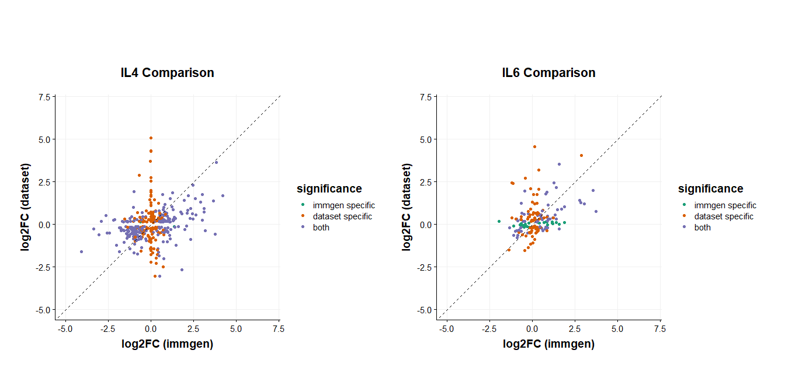
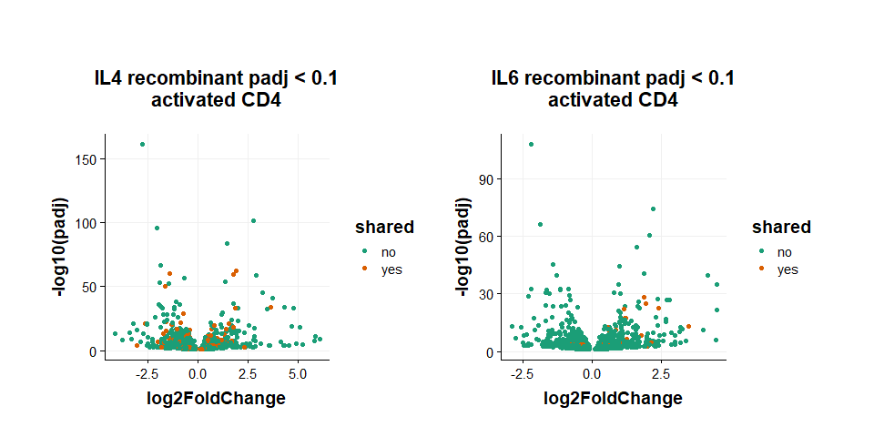

Immgen Comparison
================
Eric Y. Wang
2024-10-09

- [<u>Import Data</u>](#import-data)
- [<u>Compare</u>](#compare)

``` r
library(tidyverse)
```

    ## ── Attaching core tidyverse packages ──────────────────────── tidyverse 2.0.0 ──
    ## ✔ dplyr     1.1.4     ✔ readr     2.1.5
    ## ✔ forcats   1.0.0     ✔ stringr   1.5.1
    ## ✔ ggplot2   3.5.1     ✔ tibble    3.2.1
    ## ✔ lubridate 1.9.3     ✔ tidyr     1.3.1
    ## ✔ purrr     1.0.2     
    ## ── Conflicts ────────────────────────────────────────── tidyverse_conflicts() ──
    ## ✖ dplyr::filter() masks stats::filter()
    ## ✖ dplyr::lag()    masks stats::lag()
    ## ℹ Use the conflicted package (<http://conflicted.r-lib.org/>) to force all conflicts to become errors

``` r
library(ggplot2)
library(cowplot)
```

    ## 
    ## Attaching package: 'cowplot'
    ## 
    ## The following object is masked from 'package:lubridate':
    ## 
    ##     stamp

``` r
library(patchwork)
```

    ## 
    ## Attaching package: 'patchwork'
    ## 
    ## The following object is masked from 'package:cowplot':
    ## 
    ##     align_plots

``` r
library(DESeq2)
```

    ## Loading required package: S4Vectors
    ## Loading required package: stats4
    ## Loading required package: BiocGenerics
    ## 
    ## Attaching package: 'BiocGenerics'
    ## 
    ## The following objects are masked from 'package:lubridate':
    ## 
    ##     intersect, setdiff, union
    ## 
    ## The following objects are masked from 'package:dplyr':
    ## 
    ##     combine, intersect, setdiff, union
    ## 
    ## The following objects are masked from 'package:stats':
    ## 
    ##     IQR, mad, sd, var, xtabs
    ## 
    ## The following objects are masked from 'package:base':
    ## 
    ##     anyDuplicated, aperm, append, as.data.frame, basename, cbind,
    ##     colnames, dirname, do.call, duplicated, eval, evalq, Filter, Find,
    ##     get, grep, grepl, intersect, is.unsorted, lapply, Map, mapply,
    ##     match, mget, order, paste, pmax, pmax.int, pmin, pmin.int,
    ##     Position, rank, rbind, Reduce, rownames, sapply, setdiff, table,
    ##     tapply, union, unique, unsplit, which.max, which.min
    ## 
    ## 
    ## Attaching package: 'S4Vectors'
    ## 
    ## The following objects are masked from 'package:lubridate':
    ## 
    ##     second, second<-
    ## 
    ## The following objects are masked from 'package:dplyr':
    ## 
    ##     first, rename
    ## 
    ## The following object is masked from 'package:tidyr':
    ## 
    ##     expand
    ## 
    ## The following object is masked from 'package:utils':
    ## 
    ##     findMatches
    ## 
    ## The following objects are masked from 'package:base':
    ## 
    ##     expand.grid, I, unname
    ## 
    ## Loading required package: IRanges
    ## 
    ## Attaching package: 'IRanges'
    ## 
    ## The following object is masked from 'package:lubridate':
    ## 
    ##     %within%
    ## 
    ## The following objects are masked from 'package:dplyr':
    ## 
    ##     collapse, desc, slice
    ## 
    ## The following object is masked from 'package:purrr':
    ## 
    ##     reduce
    ## 
    ## The following object is masked from 'package:grDevices':
    ## 
    ##     windows
    ## 
    ## Loading required package: GenomicRanges
    ## Loading required package: GenomeInfoDb
    ## Loading required package: SummarizedExperiment
    ## Loading required package: MatrixGenerics
    ## Loading required package: matrixStats
    ## 
    ## Attaching package: 'matrixStats'
    ## 
    ## The following object is masked from 'package:dplyr':
    ## 
    ##     count
    ## 
    ## 
    ## Attaching package: 'MatrixGenerics'
    ## 
    ## The following objects are masked from 'package:matrixStats':
    ## 
    ##     colAlls, colAnyNAs, colAnys, colAvgsPerRowSet, colCollapse,
    ##     colCounts, colCummaxs, colCummins, colCumprods, colCumsums,
    ##     colDiffs, colIQRDiffs, colIQRs, colLogSumExps, colMadDiffs,
    ##     colMads, colMaxs, colMeans2, colMedians, colMins, colOrderStats,
    ##     colProds, colQuantiles, colRanges, colRanks, colSdDiffs, colSds,
    ##     colSums2, colTabulates, colVarDiffs, colVars, colWeightedMads,
    ##     colWeightedMeans, colWeightedMedians, colWeightedSds,
    ##     colWeightedVars, rowAlls, rowAnyNAs, rowAnys, rowAvgsPerColSet,
    ##     rowCollapse, rowCounts, rowCummaxs, rowCummins, rowCumprods,
    ##     rowCumsums, rowDiffs, rowIQRDiffs, rowIQRs, rowLogSumExps,
    ##     rowMadDiffs, rowMads, rowMaxs, rowMeans2, rowMedians, rowMins,
    ##     rowOrderStats, rowProds, rowQuantiles, rowRanges, rowRanks,
    ##     rowSdDiffs, rowSds, rowSums2, rowTabulates, rowVarDiffs, rowVars,
    ##     rowWeightedMads, rowWeightedMeans, rowWeightedMedians,
    ##     rowWeightedSds, rowWeightedVars
    ## 
    ## Loading required package: Biobase
    ## Welcome to Bioconductor
    ## 
    ##     Vignettes contain introductory material; view with
    ##     'browseVignettes()'. To cite Bioconductor, see
    ##     'citation("Biobase")', and for packages 'citation("pkgname")'.
    ## 
    ## 
    ## Attaching package: 'Biobase'
    ## 
    ## The following object is masked from 'package:MatrixGenerics':
    ## 
    ##     rowMedians
    ## 
    ## The following objects are masked from 'package:matrixStats':
    ## 
    ##     anyMissing, rowMedians

``` r
library(ComplexHeatmap)
```

    ## Loading required package: grid
    ## ========================================
    ## ComplexHeatmap version 2.20.0
    ## Bioconductor page: http://bioconductor.org/packages/ComplexHeatmap/
    ## Github page: https://github.com/jokergoo/ComplexHeatmap
    ## Documentation: http://jokergoo.github.io/ComplexHeatmap-reference
    ## 
    ## If you use it in published research, please cite either one:
    ## - Gu, Z. Complex Heatmap Visualization. iMeta 2022.
    ## - Gu, Z. Complex heatmaps reveal patterns and correlations in multidimensional 
    ##     genomic data. Bioinformatics 2016.
    ## 
    ## 
    ## The new InteractiveComplexHeatmap package can directly export static 
    ## complex heatmaps into an interactive Shiny app with zero effort. Have a try!
    ## 
    ## This message can be suppressed by:
    ##   suppressPackageStartupMessages(library(ComplexHeatmap))
    ## ========================================

``` r
knitr::opts_chunk$set(echo = TRUE)
```

``` r
source("functions/plotting_fxns.R")
theme_set(theme_Publication())
```

    ## 
    ## Attaching package: 'ggthemes'

    ## The following object is masked from 'package:cowplot':
    ## 
    ##     theme_map

### <u>Import Data</u>

``` r
# import DEGs from this analysis
# only include reference (recombinant protein) columns
actIL4 <- read_csv("analysis_outs/deg_IL4.csv") %>%
  dplyr::select(matches("_ref"))
```

    ## Rows: 1536 Columns: 16
    ## ── Column specification ────────────────────────────────────────────────────────
    ## Delimiter: ","
    ## chr  (6): ensembl_ID, gene, treatment, gene_ref, treatment_ref, significance
    ## dbl (10): baseMean, log2FoldChange, lfcSE, pvalue, padj, baseMean_ref, log2F...
    ## 
    ## ℹ Use `spec()` to retrieve the full column specification for this data.
    ## ℹ Specify the column types or set `show_col_types = FALSE` to quiet this message.

``` r
colnames(actIL4) <- gsub("_ref","",colnames(actIL4))
actIL6 <- read_csv("analysis_outs/deg_IL6.csv") %>%
  dplyr::select(matches("_ref"))
```

    ## Rows: 3083 Columns: 16
    ## ── Column specification ────────────────────────────────────────────────────────
    ## Delimiter: ","
    ## chr  (6): ensembl_ID, gene, treatment, gene_ref, treatment_ref, significance
    ## dbl (10): baseMean, log2FoldChange, lfcSE, pvalue, padj, baseMean_ref, log2F...
    ## 
    ## ℹ Use `spec()` to retrieve the full column specification for this data.
    ## ℹ Specify the column types or set `show_col_types = FALSE` to quiet this message.

``` r
colnames(actIL6) <- gsub("_ref","",colnames(actIL6))

# import immgen DEGs
immIL4 <- read_csv("external/immgen_il4_T4n_deg.csv") %>%
  mutate(log2FoldChange = log2(FC))
```

    ## Rows: 1773 Columns: 4
    ## ── Column specification ────────────────────────────────────────────────────────
    ## Delimiter: ","
    ## chr (1): gene
    ## dbl (3): FC, neg_log_10_padj, padj
    ## 
    ## ℹ Use `spec()` to retrieve the full column specification for this data.
    ## ℹ Specify the column types or set `show_col_types = FALSE` to quiet this message.

``` r
immIL6 <- read_csv("external/immgen_il6_T4n_deg.csv") %>%
  mutate(log2FoldChange = log2(FC))
```

    ## Rows: 737 Columns: 4
    ## ── Column specification ────────────────────────────────────────────────────────
    ## Delimiter: ","
    ## chr (1): gene
    ## dbl (3): FC, neg_log_10_padj, padj
    ## 
    ## ℹ Use `spec()` to retrieve the full column specification for this data.
    ## ℹ Specify the column types or set `show_col_types = FALSE` to quiet this message.

### <u>Compare</u>

``` r
# Merge the reference tibble with the comparison data
comparisonTibIl4 <- actIL4 %>%
  inner_join(immIL4, by = "gene", suffix = c("", "_ref")) %>%
  mutate(
    significance = case_when(
      padj_ref < 0.1 & padj < 0.1 ~ "both",
      padj_ref < 0.1 ~ "immgen specific",
      padj < 0.1 ~ "dataset specific",
      TRUE ~ "none"
    )) %>%
  mutate(significance = factor(significance, c("none","immgen specific","dataset specific","both"))
  ) %>%
  filter(significance != "none")

# Plotting
p1 <- ggplot(comparisonTibIl4, aes(x = log2FoldChange_ref, y = log2FoldChange, color = significance)) +
  geom_point() +
  geom_abline(slope = 1, intercept = 0, linetype = "dashed") +
  theme(aspect.ratio = 1) +
  scale_color_brewer(palette = "Dark2") +
  xlim(-5,7)+
  ylim(-5,7)+
  labs(
    title = "IL4 Comparison",
    x = "log2FC (immgen)",
    y = "log2FC (dataset)"
  )

# Merge the reference tibble with the comparison data
comparisonTibIl6 <- actIL6 %>%
  inner_join(immIL6, by = "gene", suffix = c("", "_ref")) %>%
  mutate(
    significance = case_when(
      padj_ref < 0.1 & padj < 0.1 ~ "both",
      padj_ref < 0.1 ~ "immgen specific",
      padj < 0.1 ~ "dataset specific",
      TRUE ~ "none"
    )) %>%
  mutate(significance = factor(significance, c("none","immgen specific","dataset specific","both"))
  ) %>%
  filter(significance != "none")

# Plotting
p2 <- ggplot(comparisonTibIl6, aes(x = log2FoldChange_ref, y = log2FoldChange, color = significance)) +
  geom_point() +
  geom_abline(slope = 1, intercept = 0, linetype = "dashed") +
  theme(aspect.ratio = 1) +
  scale_color_brewer(palette = "Dark2") +
  xlim(-5,7)+
  ylim(-5,7)+
  labs(
    title = "IL6 Comparison",
    x = "log2FC (immgen)",
    y = "log2FC (dataset)"
  )


p1+p2
```

<!-- -->

``` r
Il4shared <- filter(comparisonTibIl4, significance == "both")$gene
Il6shared <- filter(comparisonTibIl6, significance == "both")$gene

p1 <- actIL4 %>%
  filter(padj < 0.1) %>%
  mutate(shared = ifelse(gene %in% Il4shared, "yes","no")) %>%
  ggplot(aes(x = log2FoldChange, y = -log10(padj), color = shared)) +
    geom_point() +
    scale_color_brewer(palette = "Dark2") +
    ggtitle("IL4 recombinant padj < 0.1\nactivated CD4") +
    theme(aspect.ratio = 1)

p2 <- actIL6 %>%
  filter(padj < 0.1) %>%
  mutate(shared = ifelse(gene %in% Il6shared, "yes","no")) %>%
  ggplot(aes(x = log2FoldChange, y = -log10(padj), color = shared)) +
    geom_point() +
    scale_color_brewer(palette = "Dark2") +
    ggtitle("IL6 recombinant padj < 0.1\nactivated CD4") +
    theme(aspect.ratio = 1)

p1+p2
```

<!-- -->

``` r
actIL4 %>%
  filter(padj < 0.1) %>%
  mutate(shared = ifelse(gene %in% Il4shared, "yes","no")) %>%
  group_by(shared) %>%
  summarise(n = n()) %>%
  mutate(freq = n/sum(n))
```

    ## # A tibble: 2 × 3
    ##   shared     n  freq
    ##   <chr>  <int> <dbl>
    ## 1 no      1284 0.853
    ## 2 yes      222 0.147

``` r
actIL6 %>%
  filter(padj < 0.1) %>%
  mutate(shared = ifelse(gene %in% Il6shared, "yes","no")) %>%
  group_by(shared) %>%
  summarise(n = n()) %>%
  mutate(freq = n/sum(n))
```

    ## # A tibble: 2 × 3
    ##   shared     n   freq
    ##   <chr>  <int>  <dbl>
    ## 1 no      1535 0.962 
    ## 2 yes       60 0.0376
