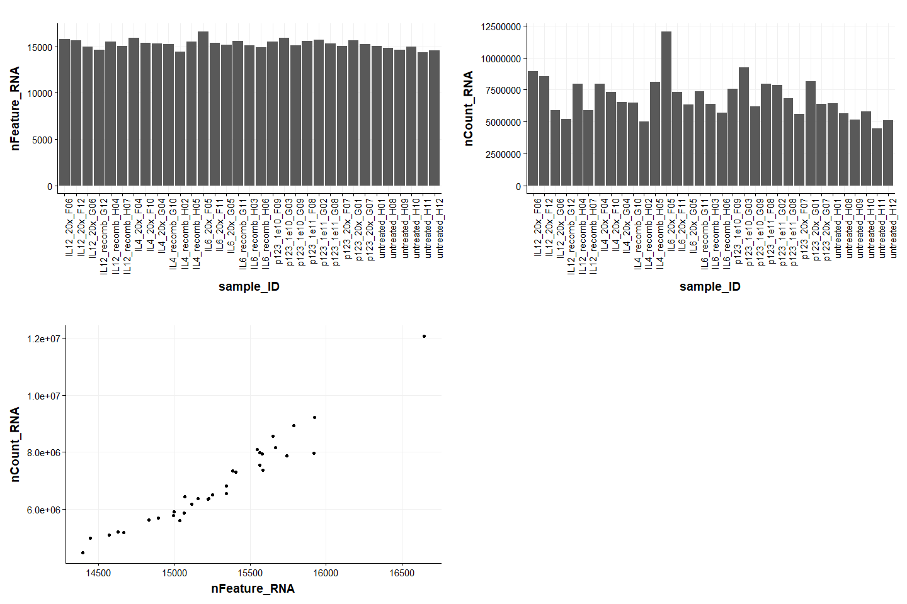

p123 RNAseq Processing
================
Eric Y. Wang
2024-08-24

- [<u>Import Data</u>](#import-data)
- [<u>Sample Level QC</u>](#sample-level-qc)
- [<u>Process and export matrix</u>](#process-and-export-matrix)

``` r
library(tidyverse)
```

    ## ── Attaching core tidyverse packages ──────────────────────── tidyverse 2.0.0 ──
    ## ✔ dplyr     1.1.4     ✔ readr     2.1.5
    ## ✔ forcats   1.0.0     ✔ stringr   1.5.1
    ## ✔ ggplot2   3.5.1     ✔ tibble    3.2.1
    ## ✔ lubridate 1.9.3     ✔ tidyr     1.3.1
    ## ✔ purrr     1.0.2     
    ## ── Conflicts ────────────────────────────────────────── tidyverse_conflicts() ──
    ## ✖ dplyr::filter() masks stats::filter()
    ## ✖ dplyr::lag()    masks stats::lag()
    ## ℹ Use the conflicted package (<http://conflicted.r-lib.org/>) to force all conflicts to become errors

``` r
library(ggplot2)
library(cowplot)
```

    ## 
    ## Attaching package: 'cowplot'
    ## 
    ## The following object is masked from 'package:lubridate':
    ## 
    ##     stamp

``` r
library(patchwork)
```

    ## 
    ## Attaching package: 'patchwork'
    ## 
    ## The following object is masked from 'package:cowplot':
    ## 
    ##     align_plots

``` r
library(DESeq2)
```

    ## Loading required package: S4Vectors
    ## Loading required package: stats4
    ## Loading required package: BiocGenerics
    ## 
    ## Attaching package: 'BiocGenerics'
    ## 
    ## The following objects are masked from 'package:lubridate':
    ## 
    ##     intersect, setdiff, union
    ## 
    ## The following objects are masked from 'package:dplyr':
    ## 
    ##     combine, intersect, setdiff, union
    ## 
    ## The following objects are masked from 'package:stats':
    ## 
    ##     IQR, mad, sd, var, xtabs
    ## 
    ## The following objects are masked from 'package:base':
    ## 
    ##     anyDuplicated, aperm, append, as.data.frame, basename, cbind,
    ##     colnames, dirname, do.call, duplicated, eval, evalq, Filter, Find,
    ##     get, grep, grepl, intersect, is.unsorted, lapply, Map, mapply,
    ##     match, mget, order, paste, pmax, pmax.int, pmin, pmin.int,
    ##     Position, rank, rbind, Reduce, rownames, sapply, setdiff, table,
    ##     tapply, union, unique, unsplit, which.max, which.min
    ## 
    ## 
    ## Attaching package: 'S4Vectors'
    ## 
    ## The following objects are masked from 'package:lubridate':
    ## 
    ##     second, second<-
    ## 
    ## The following objects are masked from 'package:dplyr':
    ## 
    ##     first, rename
    ## 
    ## The following object is masked from 'package:tidyr':
    ## 
    ##     expand
    ## 
    ## The following object is masked from 'package:utils':
    ## 
    ##     findMatches
    ## 
    ## The following objects are masked from 'package:base':
    ## 
    ##     expand.grid, I, unname
    ## 
    ## Loading required package: IRanges
    ## 
    ## Attaching package: 'IRanges'
    ## 
    ## The following object is masked from 'package:lubridate':
    ## 
    ##     %within%
    ## 
    ## The following objects are masked from 'package:dplyr':
    ## 
    ##     collapse, desc, slice
    ## 
    ## The following object is masked from 'package:purrr':
    ## 
    ##     reduce
    ## 
    ## The following object is masked from 'package:grDevices':
    ## 
    ##     windows
    ## 
    ## Loading required package: GenomicRanges
    ## Loading required package: GenomeInfoDb
    ## Loading required package: SummarizedExperiment
    ## Loading required package: MatrixGenerics
    ## Loading required package: matrixStats
    ## 
    ## Attaching package: 'matrixStats'
    ## 
    ## The following object is masked from 'package:dplyr':
    ## 
    ##     count
    ## 
    ## 
    ## Attaching package: 'MatrixGenerics'
    ## 
    ## The following objects are masked from 'package:matrixStats':
    ## 
    ##     colAlls, colAnyNAs, colAnys, colAvgsPerRowSet, colCollapse,
    ##     colCounts, colCummaxs, colCummins, colCumprods, colCumsums,
    ##     colDiffs, colIQRDiffs, colIQRs, colLogSumExps, colMadDiffs,
    ##     colMads, colMaxs, colMeans2, colMedians, colMins, colOrderStats,
    ##     colProds, colQuantiles, colRanges, colRanks, colSdDiffs, colSds,
    ##     colSums2, colTabulates, colVarDiffs, colVars, colWeightedMads,
    ##     colWeightedMeans, colWeightedMedians, colWeightedSds,
    ##     colWeightedVars, rowAlls, rowAnyNAs, rowAnys, rowAvgsPerColSet,
    ##     rowCollapse, rowCounts, rowCummaxs, rowCummins, rowCumprods,
    ##     rowCumsums, rowDiffs, rowIQRDiffs, rowIQRs, rowLogSumExps,
    ##     rowMadDiffs, rowMads, rowMaxs, rowMeans2, rowMedians, rowMins,
    ##     rowOrderStats, rowProds, rowQuantiles, rowRanges, rowRanks,
    ##     rowSdDiffs, rowSds, rowSums2, rowTabulates, rowVarDiffs, rowVars,
    ##     rowWeightedMads, rowWeightedMeans, rowWeightedMedians,
    ##     rowWeightedSds, rowWeightedVars
    ## 
    ## Loading required package: Biobase
    ## Welcome to Bioconductor
    ## 
    ##     Vignettes contain introductory material; view with
    ##     'browseVignettes()'. To cite Bioconductor, see
    ##     'citation("Biobase")', and for packages 'citation("pkgname")'.
    ## 
    ## 
    ## Attaching package: 'Biobase'
    ## 
    ## The following object is masked from 'package:MatrixGenerics':
    ## 
    ##     rowMedians
    ## 
    ## The following objects are masked from 'package:matrixStats':
    ## 
    ##     anyMissing, rowMedians

``` r
library(Matrix)
```

    ## 
    ## Attaching package: 'Matrix'
    ## 
    ## The following object is masked from 'package:S4Vectors':
    ## 
    ##     expand
    ## 
    ## The following objects are masked from 'package:tidyr':
    ## 
    ##     expand, pack, unpack

``` r
knitr::opts_chunk$set(echo = TRUE)
```

``` r
source("functions/plotting_fxns.R")
theme_set(theme_Publication())
```

    ## 
    ## Attaching package: 'ggthemes'

    ## The following object is masked from 'package:cowplot':
    ## 
    ##     theme_map

### <u>Import Data</u>

Create counts matrix

``` r
matrix_dir <- "C:/Users/Eric/My Drive/Lab/datasets/EYW/RNAseq_p123_240806/star_outputSolo.out/Gene/raw/"

# import UMI count matrix
mat <- readMM("C:/Users/Eric/My Drive/Lab/datasets/EYW/RNAseq_p123_240806/star_outputSolo.out/Gene/raw/umiDedup-NoDedup.mtx") %>%
  as.matrix() %>%
  as.data.frame()

# import feature names
featureNames <- read_tsv("C:/Users/Eric/My Drive/Lab/datasets/EYW/RNAseq_p123_240806/star_outputSolo.out/Gene/raw/features.tsv", col_names = F)
```

    ## Rows: 57186 Columns: 3
    ## ── Column specification ────────────────────────────────────────────────────────
    ## Delimiter: "\t"
    ## chr (3): X1, X2, X3
    ## 
    ## ℹ Use `spec()` to retrieve the full column specification for this data.
    ## ℹ Specify the column types or set `show_col_types = FALSE` to quiet this message.

``` r
colnames(featureNames) <- c("ensembl_ID","gene","category")

# import barcode names
barcodeNames <- read_tsv("C:/Users/Eric/My Drive/Lab/datasets/EYW/RNAseq_p123_240806/star_outputSolo.out/Gene/raw/barcodes.tsv", col_names = F)
```

    ## Rows: 96 Columns: 1
    ## ── Column specification ────────────────────────────────────────────────────────
    ## Delimiter: "\t"
    ## chr (1): X1
    ## 
    ## ℹ Use `spec()` to retrieve the full column specification for this data.
    ## ℹ Specify the column types or set `show_col_types = FALSE` to quiet this message.

``` r
colnames(barcodeNames) <- "barcode"

colnames(mat) <- barcodeNames$barcode
rownames(mat) <- featureNames$ensembl_ID
```

Create metadata assignments

``` r
# import barcode sample assignments
metadata <- read_csv("C:/Users/Eric/My Drive/Lab/datasets/EYW/RNAseq_p123_240806/sample_metadata.csv")
```

    ## Rows: 96 Columns: 4
    ## ── Column specification ────────────────────────────────────────────────────────
    ## Delimiter: ","
    ## chr (4): well, barcode, treatment, replicate
    ## 
    ## ℹ Use `spec()` to retrieve the full column specification for this data.
    ## ℹ Specify the column types or set `show_col_types = FALSE` to quiet this message.

``` r
# merge barcode sample assignments with barcode names
metadata <- left_join(barcodeNames,metadata) %>%
  mutate(sample_ID = paste0(treatment,"_",well)) %>%
  drop_na()
```

    ## Joining with `by = join_by(barcode)`

``` r
mat <- mat[,metadata$barcode]
colnames(mat) <- metadata$sample_ID
```

### <u>Sample Level QC</u>

``` r
sampleQC <- tibble(sample_ID = colnames(mat),
                   nFeature_RNA = colSums(mat > 0),
                   nCount_RNA = colSums(mat)) %>%
  left_join(metadata)
```

    ## Joining with `by = join_by(sample_ID)`

``` r
p1 <- ggplot(sampleQC, aes(x = sample_ID, y = nFeature_RNA)) +
  geom_bar(stat = "identity") +
  theme(axis.text.x = element_text(angle = 90, hjust = 1))

p2 <- ggplot(sampleQC, aes(x = sample_ID, y = nCount_RNA)) +
  geom_bar(stat = "identity") +
  theme(axis.text.x = element_text(angle = 90, hjust = 1))

p3 <- ggplot(sampleQC, aes(x = nFeature_RNA, y = nCount_RNA)) +
  geom_point()

plot_grid(p1,p2,p3, ncol = 2)
```

<!-- -->

### <u>Process and export matrix</u>

``` r
paste0(sum(rowSums(mat > 0) > 0)," genes have counts > 0 in at least one sample")
```

    ## [1] "25316 genes have counts > 0 in at least one sample"

``` r
paste0(sum(rowSums(mat > 0) == 33)," genes have counts > 0 in at all samples")
```

    ## [1] "11019 genes have counts > 0 in at all samples"

``` r
# remove genes that are not expressed in any sample
mat <- mat[rowSums(mat > 0) > 0,]

write_csv(mat, "C:/Users/Eric/My Drive/Lab/datasets/EYW/RNAseq_p123_240806/processed_data/RNAseq_p123_counts.csv")
write_csv(metadata, "C:/Users/Eric/My Drive/Lab/datasets/EYW/RNAseq_p123_240806/processed_data/processed_metadata.csv")
```
